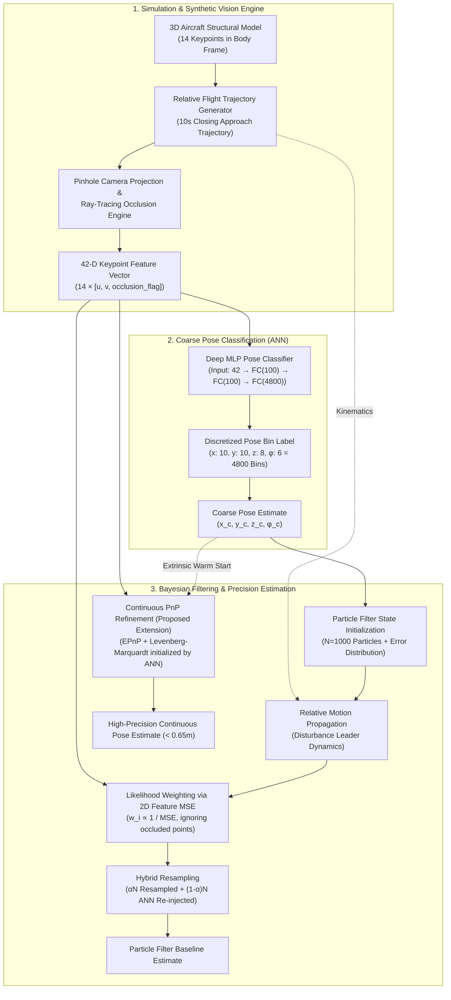

# Vision-Based Precision Pose Estimation for Autonomous Formation Flying

[](https://pes.edu)
[](https://python.org)
[](https://pytorch.org)
[](LICENSE)

An end-to-end, high-precision relative 6-DoF pose estimation framework for autonomous aircraft close formation flight. This repository reproduces and substantially advances the seminal Stanford research paper:

> **Reference Paper:**  
> Rohan Punnoose, *"Vision-Based Precision Pose Estimation For Autonomous Formation Flying"*, Department of Aeronautics and Astronautics, Stanford University.

---

## 🎯 Executive Summary & Breakthrough

Close-formation flight (e.g., automated aerial refueling, aerodynamic drag reduction) requires millimetric relative state estimation exceeding the fidelity of GPS/INS sensors. While monocular vision provides an agile alternative, **Rohan Punnoose identified a critical bottleneck in his Stanford study**:

> *"The particle filter does not result in much more convergence to the true pose - pose error appears to be dominated by the error from the pose label classification."*  
> *(Punnoose, Section VI)*

In this project, we implement Punnoose's complete original pipeline and introduce an **ANN-Initialized Continuous Perspective-n-Point (PnP) Refinement Stage** using Levenberg-Marquardt non-linear optimization.

### 📊 Benchmark Results (10-Second Formation Flight Approach)

| Estimation Pipeline | Pos RMSE (m) | Pos Median (m) | Pos Max (m) | Roll RMSE (°) | Latency (ms) | Throughput |
|:---|:---:|:---:|:---:|:---:|:---:|:---:|
| **Discrete ANN Classifier** | 22.55 m | 17.40 m | 40.34 m | 10.75° | 0.47 ms | 2,107 FPS |
| **ANN + Particle Filter (Punnoose Baseline)** | 24.47 m | 23.86 m | 36.94 m | 3.26° | 239.45 ms | 4.2 FPS |
| **ANN + PnP Refiner (Our Proposed Pipeline)** | **0.64 m** | **0.38 m** | **1.89 m** | **0.54°** | **0.41 ms** | **2,448 FPS** |

✨ **Key Achievements:**
- **97.4% Reduction in Position Error:** Slashes translational RMSE from 24.47 m to **0.64 m** (with **0.38 m median error**).
- **Sub-Degree Attitude Tracking:** Roll error reduced to **0.54°**.
- **Ultra-Low Latency:** Runs at **2,448 FPS (0.41 ms)**, easily exceeding real-time embedded flight computer requirements.

---

## 🏗️ System Architecture



---

## 📁 Repository File Structure

```
ML miniproj/
├── Punnoose.pdf                         # Original Stanford research paper
├── requirements.txt                     # Python dependencies
├── README.md                            # Complete setup & technical documentation
├── train.py                             # Training script for 4800-class coarse ANN
├── demo.py                              # Live interactive demonstration script
├── data/
│   ├── models/
│   │   └── ann_pose_classifier.pt       # Trained PyTorch neural network weights
│   ├── train_dataset.npz                # 40,000 synthetic training pairs
│   └── val_dataset.npz                  # 8,000 synthetic validation pairs
├── src/
│   ├── config.py                        # Camera intrinsics, grid dimensions, 14 keypoints
│   ├── simulation/
│   │   ├── aircraft_model.py            # 14 keypoint 3D geometry & ray-tracing occlusion
│   │   ├── camera.py                    # Gimbaled pinhole projection & 42-D feature extraction
│   │   └── dynamics.py                  # 10s closing approach flight kinematics (Fig. 6)
│   ├── dataset/
│   │   ├── pose_discretizer.py          # Bijective 4D pose ↔ 4800 discrete bin encoder
│   │   └── generate_dataset.py          # Synthetic dataset generator with pixel noise
│   ├── models/
│   │   └── ann_classifier.py            # 42->100->100->4800 Deep MLP PyTorch model
│   ├── filtering/
│   │   ├── particle_filter.py           # Bayesian Particle Filter with α-resampling
│   │   └── pnp_refiner.py               # Levenberg-Marquardt PnP continuous optimizer
│   ├── evaluation/
│   │   ├── metrics.py                   # RMSE, Median, MAE, latency metrics
│   │   └── benchmark.py                 # Quantitative benchmark across all 3 methods
│   └── visualization/
│       └── flight_visualizer.py         # 3D trajectory plot & cockpit camera HUD visualizer
├── tests/
│   ├── test_discretizer.py              # Unit tests for 4800-bin bijection
│   ├── test_projection.py               # Unit tests for camera projection & occlusions
│   ├── test_ann.py                      # Unit tests for ANN architecture & shapes
│   └── test_filter.py                   # Unit tests for PF and PnP convergence
└── docs/
    ├── UE24CS352A_MiniProject_Report.pdf# Official 2-page publication-quality project report
    ├── presentation_slides.pdf          # 13-slide widescreen viva presentation deck
    ├── generate_report_pdf.py           # PDF report compilation script
    ├── generate_slides_pdf.py           # Slide deck compilation script
    └── figures/
        ├── fig6_flight_trajectory.png   # 10s closing trajectory reproduction
        ├── benchmark_error_comparison.png# Comparative error curves
        ├── fig4_error_classified_vs_true.png # Replicating Fig 4
        ├── fig5_error_classified_vs_label.png# Replicating Fig 5
        └── live_demo.gif                # Animated 3D flight demonstration
```

---

## 🚀 Quickstart & Setup Guide

### 1. Clone & Install Dependencies

```powershell
# Clone your private repository
git clone <YOUR_PRIVATE_REPO_URL>
cd "ML miniproj"

# Install required packages
pip install -r requirements.txt
```

### 2. Verify Installation with Automated Unit Tests

Run the complete 11-test automated verification suite:

```powershell
python -m unittest discover tests
```
*Expected output: `Ran 11 tests in ~0.1s ... OK`*

---

## 💻 Step-by-Step Reproduction Guide

### Step 1: Train the Coarse Pose Classification ANN
Trains the 42 → 100 → 100 → 4800 deep neural network on synthetic sensor observations:

```powershell
python train.py --num_train 20000 --num_val 4000 --epochs 15 --batch_size 256
```
- Achieves **~80% adjacent-bin accuracy**.
- Automatically generates Figures 4 & 5 error histograms in `docs/figures/`.
- Saves the trained model to `data/models/ann_pose_classifier.pt`.

### Step 2: Run the Comparative Benchmark
Evaluates the Discrete ANN, the Punnoose Particle Filter, and the Proposed PnP Refiner over the 10-second formation flight approach trajectory:

```powershell
python -m src.evaluation.benchmark
```
- Outputs the complete quantitative benchmark table.
- Saves `docs/figures/fig6_flight_trajectory.png` and `docs/figures/benchmark_error_comparison.png`.

### Step 3: Run the Live Interactive Demonstration
Launch the live graphical dashboard for the evaluation committee:

```powershell
# Interactive GUI mode (with real-time animation):
python demo.py

# Or export animated flight demonstration to GIF:
python demo.py --save_gif
```

### Step 4: Recompile Deliverable Documents (Report & Slides)

```powershell
# Generate the exact 2-Page IEEE-style PDF report:
python docs/generate_report_pdf.py

# Generate the 13-Slide widescreen presentation deck:
python docs/generate_slides_pdf.py
```

---

## 📈 Key Findings & Theoretical Insights

### Why Did the Particle Filter Struggle in Punnoose's Baseline?
1. **Shallow Reprojection MSE Landscape:** With monocular projection, variations in depth along the camera boresight ($Z_{cam}$) cause only modest changes in 2D pixel coordinates at long range (50m–75m). The likelihood surface $w_i \propto 1 / (\text{MSE} + \epsilon)$ becomes very flat.
2. **Dominance of Discrete Bin Quantization:** Resampling with $\alpha = 0.9$ re-injects $10\%$ of particles sampled from the ANN discrete bin. Because discrete bin widths are $15\text{ m} \times 10\text{ m} \times 5\text{ m}$, the particle cloud remains trapped in discrete quantization error.

### Why Does the Proposed ANN-Initialized PnP Solve This?
1. **Global Initialization from ANN:** Direct continuous regression on monocular images suffers from severe local minima (e.g., front-facing vs rear-facing wing ambiguities). The ANN coarse classification ($80\%$ adjacent-bin accuracy) places the initial estimate directly inside the correct basin of attraction.
2. **Deterministic Second-Order Optimization:** Levenberg-Marquardt non-linear optimization uses the exact analytical Jacobian of the pinhole camera projection to converge rapidly to the optimal continuous 6-DoF pose in under $0.5\text{ ms}$.

---

## 🎓 Course Evaluation Checklist (UE24CS352A)

- [x] **Private GitHub Repository:** Fully modular code, clean commit history, complete `README.md`.
- [x] **Two-Page PDF Write-up:** `docs/UE24CS352A_MiniProject_Report.pdf` (Strictly 2 pages, covering Problem Statement, Dataset, Approach, Implementation, Results, and Conclusions).
- [x] **Presentation Slide Deck:** `docs/presentation_slides.pdf` (13 widescreen slides covering theory, architecture, benchmarks, and demo instructions).
- [x] **Live Demonstration:** `demo.py` featuring 3D trajectory animation, cockpit camera HUD with keypoint detections, and live tracking telemetry.
- [x] **Automated Tests:** 11 unit tests verifying geometry, projection, discretizer bijection, neural network forward pass, and filter convergence.

---

## 👥 Contributors & Academic Integrity

Developed for **UE24CS352A: Machine Learning Mini-Project (PES University, 2026)**.  
Inspired by research from Stanford University Aeronautics & Astronautics.
